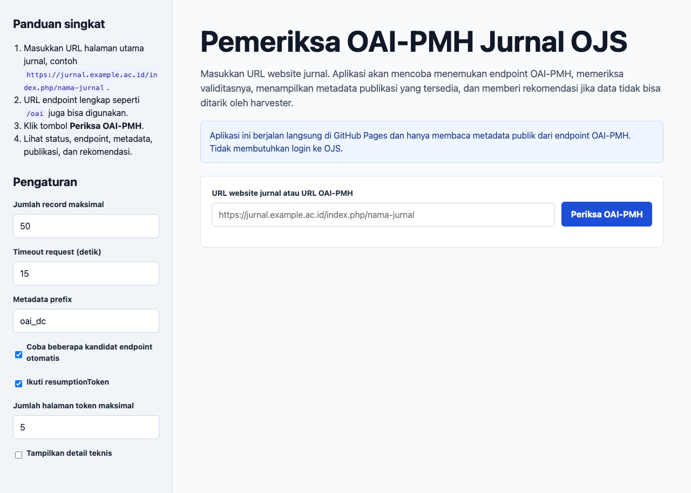

# ojs-oai-pmh-checker

Aplikasi Streamlit untuk memeriksa validitas OAI-PMH pada website jurnal, khususnya jurnal berbasis Open Journal Systems atau OJS.

Aplikasi ini membantu pengelola jurnal melihat apakah metadata publik dapat ditarik oleh harvester, endpoint mana yang valid, format metadata apa yang tersedia, kualitas metadata record, dan rekomendasi tindakan untuk pengelola jurnal serta tim IT.

Repository publik:

```text
https://github.com/ikhwan-arief/ojs-oai-pmh-checker
```

URL aplikasi publik GitHub Pages:

```text
https://ikhwan-arief.github.io/ojs-oai-pmh-checker/
```

URL tersebut menjalankan versi web publik yang bisa dipakai langsung dari browser.

## Screenshot



Screenshot ini diambil dari aplikasi Streamlit yang dijalankan lokal.

## Fungsi Utama

- User cukup memasukkan URL website jurnal.
- Aplikasi mencari kandidat endpoint OAI-PMH secara otomatis.
- Aplikasi memvalidasi `Identify`, `ListMetadataFormats`, dan `ListRecords`.
- Aplikasi menampilkan daftar publikasi yang bisa dibaca harvester.
- Aplikasi memberi skor harvestability 0 sampai 100.
- Aplikasi memberi rekomendasi action terpisah untuk pengelola jurnal dan tim IT.
- Aplikasi dapat mengekspor publikasi CSV, rekomendasi CSV, audit JSON, ringkasan Markdown, dan laporan TXT.

## Requirements

- Python 3.11 atau lebih baru
- Koneksi internet untuk memeriksa endpoint jurnal publik

## Cara Menjalankan Lokal

```bash
python -m venv .venv
source .venv/bin/activate
pip install -r requirements.txt
streamlit run app.py
```

Setelah Streamlit berjalan, buka URL lokal yang ditampilkan di terminal.

## Cara Deploy Versi Streamlit ke Streamlit Community Cloud

1. Push repository ini ke GitHub.
2. Buka Streamlit Community Cloud.
3. Pilih repository `ikhwan-arief/ojs-oai-pmh-checker`.
4. Set **Main file path** ke:

```text
app.py
```

5. Deploy aplikasi.

## Contoh URL Input

URL halaman utama jurnal:

```text
https://jurnal.example.ac.id/index.php/nama-jurnal
```

URL endpoint OAI-PMH langsung:

```text
https://jurnal.example.ac.id/index.php/nama-jurnal/oai
```

URL OJS lama:

```text
https://jurnal.example.ac.id/index.php?journal=nama-jurnal&page=oai
```

## Penjelasan Status Harvestability

- **Siap di-harvest**: endpoint valid, `oai_dc` tersedia, record ditemukan, dan metadata utama relatif lengkap.
- **Bisa di-harvest, tetapi perlu perbaikan**: endpoint bisa dibaca, tetapi ada masalah kualitas metadata atau konfigurasi minor.
- **Berisiko gagal atau hanya tertarik sebagian**: sebagian proses berjalan, tetapi ada risiko harvester gagal atau data tidak lengkap.
- **Kemungkinan besar gagal di-harvest**: endpoint tidak valid, server menolak request, XML tidak valid, atau ListRecords gagal.

## Rekomendasi Action

Tab **Rekomendasi Action** membedakan:

- pekerjaan editorial yang dapat dilakukan pengelola jurnal, seperti memeriksa status published, melengkapi metadata, dan memperbaiki tanggal publikasi;
- pekerjaan teknis yang perlu ditangani tim IT, seperti routing `/oai`, `base_url`, SSL, firewall, error PHP, cache, dan performa server.

## Peran Pengelola Jurnal

Pengelola jurnal biasanya perlu memastikan:

- URL yang diperiksa adalah URL jurnal, bukan portal institusi;
- issue dan artikel sudah dipublikasikan;
- metadata artikel utama lengkap;
- tanggal publikasi, abstrak, penulis, DOI, bahasa, dan publisher terisi benar.

## Peran Tim IT atau Admin Server

Tim IT biasanya perlu memastikan:

- endpoint `/oai?verb=Identify` dapat diakses publik;
- konfigurasi OJS, `base_url`, rewrite URL, dan routing benar;
- SSL valid;
- firewall, WAF, Cloudflare, atau ModSecurity tidak memblokir harvester;
- error PHP tidak bocor ke output XML;
- `resumptionToken` dan performa server stabil.

## Batasan

- Aplikasi hanya memeriksa metadata publik OAI-PMH.
- Aplikasi tidak membutuhkan login ke OJS.
- Aplikasi tidak menjamin Portal Garuda atau sistem indeks lain langsung menarik data setelah endpoint sehat.
- Beberapa OJS memakai konfigurasi URL khusus yang mungkin tidak terdeteksi otomatis.
- Hasil tergantung ketersediaan server jurnal saat diperiksa.
- Aplikasi tidak mengambil PDF artikel, gambar, ZIP, atau file besar.

## Catatan Keamanan

Aplikasi menerima URL bebas dari user, sehingga pemeriksaan dibatasi:

- hanya skema `http` dan `https`;
- blok `localhost`, `127.0.0.1`, `0.0.0.0`, `::1`, dan private IP range;
- hostname di-resolve ke IP lalu dicek agar tidak mengarah ke alamat lokal/private;
- redirect dibatasi;
- ukuran respons dibatasi;
- request fokus pada kandidat endpoint OAI-PMH, bukan crawler umum;
- data URL user tidak disimpan permanen.

User-Agent yang digunakan:

```text
OJS-OAI-PMH-Checker/1.0 (+https://github.com/ikhwan-arief/ojs-oai-pmh-checker)
```

## Verifikasi Developer

```bash
pytest
ruff check .
```

## Lisensi

MIT License. Lihat file `LICENSE`.
